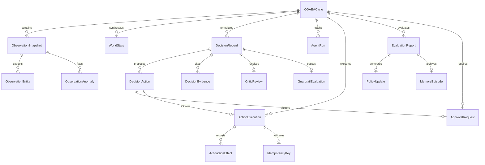

# Backend Architecture & Technical Specification

## 1. System Decomposition

The backend of the **Autonomous AI Business Operations Manager** is constructed as an asynchronous, modular service layer built with **Python 3.11+**, **FastAPI**, **SQLAlchemy 2.0 (Async)**, and **Pydantic v2**.

```
                           ┌─────────────────────────┐
                           │      React Frontend     │
                           └────────────┬────────────┘
                                        │ HTTP / WS
                                        ▼
                           ┌─────────────────────────┐
                           │   FastAPI API Gateway   │
                           │  - JWT Auth & RBAC      │
                           │  - Distributed Tracing  │
                           │  - Error Handling       │
                           └────────────┬────────────┘
                                        │
                 ┌──────────────────────┼──────────────────────┐
                 ▼                      ▼                      ▼
        ┌──────────────────┐  ┌──────────────────┐  ┌──────────────────┐
        │  REST Endpoints  │  │  WebSocket Hub   │  │  Health & Ops    │
        │  (/api/cycles,   │  │  (/ws/events)    │  │  (/api/health,   │
        │   /api/actions)  │  │                  │  │   /api/audit)    │
        └────────┬─────────┘  └────────┬─────────┘  └────────┬─────────┘
                 │                     │                     │
                 └─────────────────────┼─────────────────────┘
                                       ▼
                       ┌───────────────────────────────┐
                       │       ODAEAFlowEngine         │
                       │    (Durable State Machine)    │
                       └───────────────┬───────────────┘
                                       │
        ┌────────────────┬─────────────┼─────────────┬────────────────┐
        ▼                ▼             ▼             ▼                ▼
┌──────────────┐ ┌──────────────┐ ┌──────────┐ ┌──────────────┐ ┌──────────────┐
│ Observer &   │ │ Planner &    │ │Guardrail │ │ Actuator &   │ │ Evaluator &  │
│ Aggregator   │ │ Critic       │ │ Engine   │ │ Integrations │ │ Adapter      │
└───────┬──────┘ └───────┬──────┘ └────┬─────┘ └──────┬───────┘ └──────┬───────┘
        │                │             │              │                │
        └────────────────┼─────────────┼──────────────┼────────────────┘
                         ▼             ▼              ▼
                 ┌─────────────────────────────────────────────┐
                 │          Data & Persistence Layer           │
                 │  - PostgreSQL / SQLite (SQLAlchemy Async)  │
                 │  - Episodic Memory & Semantic Vector Store │
                 │  - Immutable Audit Log                      │
                 └─────────────────────────────────────────────┘
```

---

## 2. Application Lifecycle & Middleware (`main.py`)

The FastAPI application lifecycle is managed using the modern `asynccontextmanager` pattern:

* **Startup (`lifespan`)**:
  1. Initializes the database schema (`init_database`).
  2. Seeds default enterprise organizations, users, demo policies, agent prompt records, and initial operational anomalies (`SeedService.seed_all`).
* **Request Tracing Middleware**:
  * Extracts or generates `X-Request-ID` and `X-Trace-ID` (OpenTelemetry-compatible).
  * Measures end-to-end API latency in milliseconds (`X-Process-Time-Ms`).
  * Emits structured JSON access logs with request correlation IDs.
* **CORS Middleware**:
  * Configured via `CORS_ORIGINS` to safely allow frontend interactions.
* **Standardized Exception Handlers**:
  * Catches `AppError` and validation errors, returning standardized JSON error envelopes.

---

## 3. API Endpoint Reference

The backend exposes 16 modular API routers under the `/api` namespace:

| Router Prefix | Source File | Purpose |
| :--- | :--- | :--- |
| `/api/auth` | [api/auth.py](file:///c:/Projects/Autonomous%20AI%20Business%20Operations%20Manager/backend/app/api/auth.py) | User login, JWT token issuance, session profile retrieval, and RBAC checks. |
| `/api/dashboard` | [api/dashboard.py](file:///c:/Projects/Autonomous%20AI%20Business%20Operations%20Manager/backend/app/api/dashboard.py) | High-level business health scores, active anomalies, pending approvals count, and KPI sparklines. |
| `/api/cycles` | [api/cycles.py](file:///c:/Projects/Autonomous%20AI%20Business%20Operations%20Manager/backend/app/api/cycles.py) | Trigger manual or scheduled ODAEA cycles, inspect stage progression, and list cycle histories. |
| `/api/observations` | [api/observations.py](file:///c:/Projects/Autonomous%20AI%20Business%20Operations%20Manager/backend/app/api/observations.py) | Query raw observation snapshots, entities observed, and detected anomalies. |
| `/api/decisions` | [api/decisions.py](file:///c:/Projects/Autonomous%20AI%20Business%20Operations%20Manager/backend/app/api/decisions.py) | Inspect AI-proposed decisions, evidence citations, rationale summaries, and critic review statuses. |
| `/api/approvals` | [api/approvals.py](file:///c:/Projects/Autonomous%20AI%20Business%20Operations%20Manager/backend/app/api/approvals.py) | Human-in-the-loop queue: list pending approvals, approve actions, or reject proposed actions with reasons. |
| `/api/actions` | [api/actions.py](file:///c:/Projects/Autonomous%20AI%20Business%20Operations%20Manager/backend/app/api/actions.py) | Action execution records, idempotency keys, payloads, and before/after side-effect diffs. |
| `/api/evaluations` | [api/evaluations.py](file:///c:/Projects/Autonomous%20AI%20Business%20Operations%20Manager/backend/app/api/evaluations.py) | Post-execution evaluation reports, metric deltas, and goal achievement ratings. |
| `/api/agents` | [api/agents.py](file:///c:/Projects/Autonomous%20AI%20Business%20Operations%20Manager/backend/app/api/agents.py) | Agent run histories, token consumption, model latencies, prompt versions, and LLM costs. |
| `/api/memory` | [api/memory.py](file:///c:/Projects/Autonomous%20AI%20Business%20Operations%20Manager/backend/app/api/memory.py) | Query episodic memory runs and perform semantic vector searches across organizational knowledge. |
| `/api/policies` | [api/policies.py](file:///c:/Projects/Autonomous%20AI%20Business%20Operations%20Manager/backend/app/api/policies.py) | Read active policy rules, review pending policy updates, and publish new policy versions. |
| `/api/integrations` | [api/integrations.py](file:///c:/Projects/Autonomous%20AI%20Business%20Operations%20Manager/backend/app/api/integrations.py) | Inspect integration connector health, test connections, and toggle mock/live modes. |
| `/api/audit` | [api/audit.py](file:///c:/Projects/Autonomous%20AI%20Business%20Operations%20Manager/backend/app/api/audit.py) | Immutable audit log trail, filterable by actor, action, domain, date range, and trace ID. |
| `/api/health` | [api/health.py](file:///c:/Projects/Autonomous%20AI%20Business%20Operations%20Manager/backend/app/api/health.py) | System liveness (`/live`), readiness (`/ready`), and component health matrix (DB, Worker, LLMs). |
| `/api/settings` | [api/settings.py](file:///c:/Projects/Autonomous%20AI%20Business%20Operations%20Manager/backend/app/api/settings.py) | Manage kill switches (Global/Domain/Agent/Integration) and active autonomy tiers. |
| `/api/simulations` | [api/simulations.py](file:///c:/Projects/Autonomous%20AI%20Business%20Operations%20Manager/backend/app/api/simulations.py) | Inject synthetic business anomalies (e.g. churn spike, invoice failure, SLA breach) for testing. |
| `/ws/events` | [api/websocket.py](file:///c:/Projects/Autonomous%20AI%20Business%20Operations%20Manager/backend/app/api/websocket.py) | Real-time WebSocket connection broadcasting state transitions, approvals, and alerts. |

---

## 4. Database Schema & Models Architecture

All database models reside in [backend/app/models/](file:///c:/Projects/Autonomous%20AI%20Business%20Operations%20Manager/backend/app/models/) and inherit from an asynchronous SQLAlchemy Base with standard `id` (UUIDv4), `created_at`, `updated_at`, and `version` fields.



### Key Models Summary
1. **`ODAEACycle`** ([models/cycle.py](file:///c:/Projects/Autonomous%20AI%20Business%20Operations%20Manager/backend/app/models/cycle.py)): Tracks the entire lifecycle, domain (`sales`, `finance`, `support`, `marketing`, `operations`), current stage, stage progress JSON, and correlation ID.
2. **`ObservationSnapshot` & `ObservationAnomaly`** ([models/observation.py](file:///c:/Projects/Autonomous%20AI%20Business%20Operations%20Manager/backend/app/models/observation.py)): Stores raw connector payloads, extracted business entities, anomaly severity, and confidence scores.
3. **`DecisionRecord` & `DecisionAction`** ([models/decision.py](file:///c:/Projects/Autonomous%20AI%20Business%20Operations%20Manager/backend/app/models/decision.py)): Stores strategic goals, rationales, estimated cost, reversibility, risk level, and evidence citations.
4. **`CriticReview`** ([models/critic.py](file:///c:/Projects/Autonomous%20AI%20Business%20Operations%20Manager/backend/app/models/critic.py)): Records adversarial review, logic score, hallucination risk, and critique notes.
5. **`GuardrailEvaluation`** ([models/guardrail.py](file:///c:/Projects/Autonomous%20AI%20Business%20Operations%20Manager/backend/app/models/guardrail.py)): Complete evaluation trace of rule evaluations, violated policies, and final decision (`ALLOW`, `REQUIRE_APPROVAL`, `BLOCK`).
6. **`ApprovalRequest`** ([models/approval.py](file:///c:/Projects/Autonomous%20AI%20Business%20Operations%20Manager/backend/app/models/approval.py)): Stores operator reviews, status (`PENDING`, `APPROVED`, `REJECTED`), and review notes.
7. **`ActionExecution` & `IdempotencyKey`** ([models/action.py](file:///c:/Projects/Autonomous%20AI%20Business%20Operations%20Manager/backend/app/models/action.py)): Records physical tool executions, unique idempotency keys, payloads, and side-effect before/after states.
8. **`EvaluationReport`** ([models/evaluation.py](file:///c:/Projects/Autonomous%20AI%20Business%20Operations%20Manager/backend/app/models/evaluation.py)): Quantitative metric deltas (pre vs post), goal achievement boolean, and adaptation notes.
9. **`PolicyVersion` & `PolicyUpdate`** ([models/policy.py](file:///c:/Projects/Autonomous%20AI%20Business%20Operations%20Manager/backend/app/models/policy.py)): Active JSON rulesets and versioned update proposals generated by the Adapter.
10. **`MemoryEpisode` & `SemanticDocument`** ([models/memory.py](file:///c:/Projects/Autonomous%20AI%20Business%20Operations%20Manager/backend/app/models/memory.py)): Historical operational episodes and vector-searchable organizational knowledge.

---

## 5. The ODAEA State Machine (`ODAEAFlowEngine`)

The state machine is defined in [backend/app/workflow/state_machine.py](file:///c:/Projects/Autonomous%20AI%20Business%20Operations%20Manager/backend/app/workflow/state_machine.py) and executes with full database persistence at every stage transition:

### Stage Execution Pipeline
1. **`OBSERVE`**:
   * Pulls raw data from the domain connector in [integration_registry](file:///c:/Projects/Autonomous%20AI%20Business%20Operations%20Manager/backend/app/integrations/registry.py).
   * Runs [ObserverAgent](file:///c:/Projects/Autonomous%20AI%20Business%20Operations%20Manager/backend/app/agents/observer.py) to summarize observations and identify anomalies.
   * Saves `ObservationSnapshot`, `ObservationEntity`, and `ObservationAnomaly` records.
2. **`AGGREGATE`**:
   * Runs [AggregatorAgent](file:///c:/Projects/Autonomous%20AI%20Business%20Operations%20Manager/backend/app/agents/aggregator.py) to synthesize multi-entity observations into a canonical `WorldState`.
3. **`DECIDE`**:
   * Queries [SemanticMemoryStore](file:///c:/Projects/Autonomous%20AI%20Business%20Operations%20Manager/backend/app/memory/semantic.py) for domain guidelines.
   * Runs [PlannerAgent](file:///c:/Projects/Autonomous%20AI%20Business%20Operations%20Manager/backend/app/agents/planner.py) to formulate goals, evidence, and proposed actions.
   * Saves `DecisionRecord`, `DecisionAction`, and `DecisionEvidence` rows.
4. **`CRITIQUE`**:
   * Runs [CriticAgent](file:///c:/Projects/Autonomous%20AI%20Business%20Operations%20Manager/backend/app/agents/critic.py) to adversarially inspect the plan for hallucinations and risk.
   * Records a `CriticReview`.
5. **`GUARDRAIL`**:
   * Passes the primary proposed action through [GuardrailEngine](file:///c:/Projects/Autonomous%20AI%20Business%20Operations%20Manager/backend/app/guardrails/engine.py).
   * If `BLOCK` ➔ Cycle completes immediately with `BLOCKED` status.
   * If `REQUIRE_APPROVAL` ➔ Emits `ApprovalRequest`, broadcasts WebSocket alert, and pauses the cycle.
   * If `ALLOW` ➔ Auto-proceeds to the execution phase.
6. **`ACT`**:
   * Generates a deterministic idempotency key (`idem_{cycle_id}_{action_id}_{type}`).
   * Verifies the key has not already been completed.
   * Dispatches execution via [ActuatorAgent](file:///c:/Projects/Autonomous%20AI%20Business%20Operations%20Manager/backend/app/agents/actuator.py) to the target integration connector.
   * Records side-effects and logs an immutable `AuditEvent`.
7. **`EVALUATE`**:
   * Runs [EvaluatorAgent](file:///c:/Projects/Autonomous%20AI%20Business%20Operations%20Manager/backend/app/agents/evaluator.py) to calculate pre/post metric deltas.
   * Records an `EvaluationReport`.
8. **`ADAPT`**:
   * Runs [AdapterAgent](file:///c:/Projects/Autonomous%20AI%20Business%20Operations%20Manager/backend/app/agents/adapter.py) to propose policy modifications (`PolicyUpdate`).
   * Writes the episode and reward to [EpisodicMemoryManager](file:///c:/Projects/Autonomous%20AI%20Business%20Operations%20Manager/backend/app/memory/episodic.py).
   * Marks cycle `COMPLETED`.

---

## 6. Background Worker Architecture (`workers/worker.py`)

The background operations worker is an asynchronous daemon:
* Continuously cycles through business domains (`sales`, `finance`, `support`, `marketing`, `operations`).
* Executes periodic domain anomaly scans at 60-second heartbeat intervals.
* Listens for `SIGINT` / `SIGTERM` signals for graceful shutdown without interrupting in-flight database transactions.

---

## 7. Deterministic Guardrail Subsystem

The guardrail engine ([backend/app/guardrails/engine.py](file:///c:/Projects/Autonomous%20AI%20Business%20Operations%20Manager/backend/app/guardrails/engine.py)) operates purely with deterministic Python logic without LLM interference.

### Rule Evaluation Checklist
1. **Autonomy Tier Check**: If Tier 0 (Observe Only), all actions are hard-blocked.
2. **Kill Switch Check**: Checks if Global, Domain, Agent, or Integration kill switches are active.
3. **Forbidden Actions Check**: Checks against blacklisted action names (e.g. `delete_customer_database`).
4. **Domain Registry Check**: Verifies if the proposed action is registered for that domain.
5. **Cost Limit Check**: Flags actions exceeding the maximum autonomous spend limit ($5,000 default).
6. **Blast Radius Check**: Flags actions affecting more entities than the configured blast-radius ceiling (10 default).
7. **Reversibility Check**: Mandates human approval for irreversible actions.
8. **Confidence Check**: Requires high confidence (≥ 0.85) for autonomous execution.

---

## 8. Integrations & Connector Registry

All external services are registered in [backend/app/integrations/registry.py](file:///c:/Projects/Autonomous%20AI%20Business%20Operations%20Manager/backend/app/integrations/registry.py):

* **CRM (`crm.py`)**: Manages leads, deals, account representatives, and pipeline stages.
* **Finance (`finance.py`)**: Invoices, Stripe payment retries, micro-refunds, and dunning workflows.
* **Support (`support.py`)**: Zendesk/Freshdesk tickets, SLA escalations, and priority routing.
* **Marketing (`marketing.py`)**: Ad set budgets, ROAS optimization, and bid adjustments.
* **Email (`email.py`)**: Transactional email dispatch (Resend / SendGrid / SMTP).
* **Mock Subsystem**: Full realistic simulated drivers allow standalone execution without external API dependencies.

---

## 9. Observability & Telemetry

* **Distributed Tracing**: Contextual `X-Request-ID` and `X-Trace-ID` attached to every log line and database audit record.
* **Prometheus-Style Metrics**: In-memory telemetry counter and latency histogram (`metrics.increment`, `metrics.record_latency`).
* **WebSocket Event Hub** ([core/websocket.py](file:///c:/Projects/Autonomous%20AI%20Business%20Operations%20Manager/backend/app/core/websocket.py)): Real-time event broadcasting for instant UI responsiveness.
