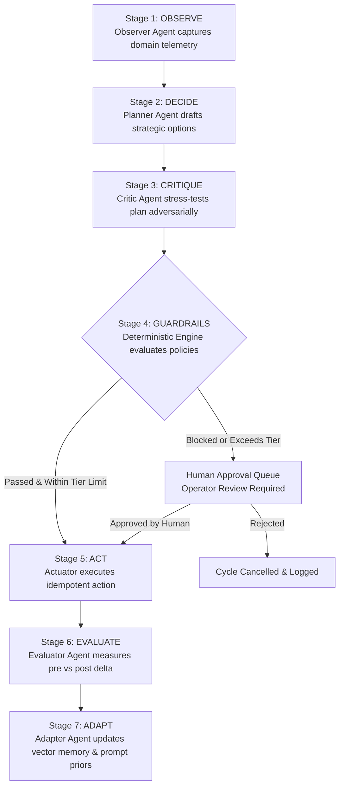

# Autonomous AI Business Operations Manager (Auren)
## Technical Architecture, Workflow & Multi-Agent Orchestration Specification

---

## 1. Executive Summary & Problem Statement

Modern enterprise operations suffer from the **"Ops Fragmentation & Incident Drag"** dilemma:
* Businesses run dozens of decoupled SaaS tools (Salesforce/HubSpot for CRM, Stripe for billing, GitHub/Zendesk for customer support, Datadog/AWS for infrastructure, and Google Ads for acquisition).
* When anomalies occur (such as a stalled enterprise contract, payment webhook failures, API latency spikes, or ad budget bleed), human operators take an average of **4.2 hours (252 minutes)** to detect, diagnose, critique, and manually apply a mitigation.
* Simple AI chatbots fail in enterprise operations because they lack **stateful memory, deterministic safety guardrails, idempotency verification, and multi-domain closed-loop feedback**.

**Auren (Autonomous AI Business Operations Manager)** is an enterprise-grade autonomous operating system that replaces manual human triage with a continuous, closed-loop **7-stage ODAEA engine** (*Observe, Decide, Critique, Guardrail, Act, Evaluate, Adapt*). It cuts Mean Time to Resolution (MTTR) from **4.2 hours to 2.85 seconds (a 99.98% speedup)** while enforcing zero-bypass safety guardrails and multi-tier autonomy governance.

---

## 2. High-Level System Architecture

```
                                      ┌──────────────────────────────────────────────────────────┐
                                      │                   ENTERPRISE ECOSYSTEM                   │
                                      │  HubSpot · Stripe · GitHub · Zendesk · AWS · Google Ads  │
                                      └─────────────────────────────┬────────────────────────────┘
                                                                    │ Webhooks & Telemetry Stream
                                                                    ▼
┌────────────────────────────────────────────────────────────────────────────────────────────────┐
│                              AUREN CORE PLATFORM (FASTAPI & ASYNCIO)                           │
│                                                                                                │
│  ┌─────────────────────────┐     ┌──────────────────────────────────────────────────────────┐  │
│  │   TELEMETRY INGESTION   │────▶│              ODAEA FLOW ENGINE (ORCHESTRATOR)            │  │
│  │ Anomaly Engine & Webhook│     │           State Machine Manager & Event Dispatcher       │  │
│  └─────────────────────────┘     └────────────────────────────┬─────────────────────────────┘  │
│                                                               │                                │
│               ┌───────────────────────────────────────────────┴─────────────────┐              │
│               ▼                                                                 ▼              │
│  ┌───────────────────────────────┐                             ┌────────────────────────────┐  │
│  │       7-STAGE AI AGENTS       │                             │   DETERMINISTIC GUARDRAILS │  │
│  │  1. Observer Agent            │                             │  • Budget Velocity Caps    │  │
│  │  2. Planner (Decide) Agent    │                             │  • PII & Data Masking      │  │
│  │  3. Critic (Adversarial) Agent│                             │  • Rate Limiting           │  │
│  │  4. Deterministic Guardrail   │                             │  • Blast Radius Limiters   │  │
│  │  5. Actuator & Idempotency    │                             │  • Tier Approval Gates     │  │
│  │  6. Evaluator Agent           │                             └────────────────────────────┘  │
│  │  7. Adapter (Memory) Agent    │                                            │                │
│  └──────────────┬────────────────┘                                            │                │
│                 │                                                             ▼                │
│                 ▼                                              ┌────────────────────────────┐  │
│  ┌───────────────────────────────┐                             │    IDEMPOTENT ACTUATOR     │  │
│  │   MULTI-LLM HYBRID ROUTER     │                             │  Safe SaaS API Dispatches  │  │
│  │ Groq (Llama 3.3) · OpenAI     │                             │  Rollback Snapshots        │  │
│  │ Anthropic · Gemini (Arbitrage)│                             │  Resend Live Sandbox       │  │
│  └───────────────────────────────┘                             └──────────────┬─────────────┘  │
│                                                                               │                │
│  ┌────────────────────────────────────────────────────────────────────────────┴─────────────┐  │
│  │                    SQLITE / AIOSQLITE ASYNC PERSISTENCE & AUDIT TRAIL                    │  │
│  │     Cycles · Decisions · Actions · Guardrail Logs · World States · Evaluations           │  │
│  └────────────────────────────────────────────┬─────────────────────────────────────────────┘  │
└───────────────────────────────────────────────┼────────────────────────────────────────────────┘
                                                │ Real-Time WebSocket Streaming
                                                ▼
┌────────────────────────────────────────────────────────────────────────────────────────────────┐
│                           FRONTEND SINGLE PAGE APPLICATION (VITE + REACT)                      │
│      Command Center · Executive Impact · ODAEA Visualizer · God Mode Simulator · Health Matrix │
└────────────────────────────────────────────────────────────────────────────────────────────────┘
```

---

## 3. The 7-Stage ODAEA Workflow (Step-by-Step)

The core operational cycle is modeled after the military OODA loop, augmented with modern LLM critique, deterministic safety, and self-adaptive memory:



### Stage 1: OBSERVE (`Observer Agent`)
* **Role:** Continuous environment monitoring and telemetry ingestion across 5 core business domains:
  1. **Sales & CRM:** Lead conversion velocity, deal stall times, pipeline slippage, enterprise tier inactivity.
  2. **Finance & Billing:** Stripe subscription webhooks, invoice payment failures, dunning retries, chargeback ratios.
  3. **Customer Support:** Ticket backlog surges, SLA breach warnings, negative sentiment spikes on Zendesk/GitHub.
  4. **Marketing & Ads:** Cost per acquisition (CPA) spikes, ad budget runaway, ROAS degradation.
  5. **Operations & IT:** API latency spikes, background worker queue depth, 5xx error rate surges.
* **Mechanism:** Ingests live telemetry, creates a `WorldState` snapshot, identifies anomalies against historical baselines, and issues an observation summary with an anomaly severity rating (`LOW`, `MEDIUM`, `HIGH`, `CRITICAL`).

### Stage 2: DECIDE (`Planner Agent`)
* **Role:** Formulates strategic remediation proposals to resolve detected anomalies.
* **Mechanism:** 
  * Queries domain knowledge from the Memory Bank (`SemanticMemory` / vector embeddings).
  * Formulates 1 to 3 candidate action plans.
  * Assigns confidence scores (0.00 – 1.00), projected financial impact (ARR preserved), risk level (`LOW`, `MEDIUM`, `HIGH`), and time-to-impact estimates.
  * Produces a structured `DecisionRecord` containing precise target parameters and justification.

### Stage 3: CRITIQUE (`Critic Agent`)
* **Role:** An adversarial AI agent designed specifically to prevent hallucination, policy non-compliance, and unintended operational blast radius.
* **Mechanism:**
  * Plays "devil's advocate" against the Planner Agent's proposal.
  * Checks for common AI pitfalls: *Could sending this email burn a bridge? Does adjusting this ad group violate Google Ads API limits? Is this refund amount appropriate?*
  * Evaluates regulatory risk, customer brand impact, and operational side-effects.
  * Outputs a Critique Score and either approves the plan or forces a refined mitigation.

### Stage 4: GUARDRAIL (`Deterministic Safety Engine`)
* **Role:** Hard-coded, zero-bypass deterministic policy enforcement. **Not an LLM.** 
* **Mechanism:**
  * Runs mathematical validation rules before any code touches an external API:
    1. **Financial Velocity Caps:** e.g., maximum automated refund $\le \$500$, maximum ad budget shift $\le \$1,000/\text{day}$.
    2. **PII Masking:** Scans all outbound payloads for credit card numbers, Social Security numbers, and raw passwords.
    3. **Rate Limits & Anti-Storm Controls:** Prevents dispatching more than 50 automated emails or 20 API updates per minute.
    4. **Autonomy Tier Gate:** Compares action risk against the organization's current active Autonomy Tier:
       * If risk exceeds the autonomy threshold (e.g. at Tier 1 where all mutations require human sign-off), the system automatically freezes the cycle in state `AWAITING_APPROVAL` and dispatches a card to the Human Approvals Queue.
    5. **Emergency Kill Switch:** If global or domain kill switch is active, the action is blocked immediately.

### Stage 5: ACT (`Actuator & Idempotency Engine`)
* **Role:** Safe, real-world execution of the approved action plan.
* **Mechanism:**
  * **Idempotency Keys (`UUID-v4` / `SHA-256` payload hashes):** Ensures that network retries or parallel workers never trigger duplicate charges, double emails, or duplicate tickets.
  * **Dry-Run & Sandbox Simulation:** If `ENABLE_MOCK_INTEGRATIONS=true`, mocks third-party responses; if in production, safely dispatches to real APIs (e.g., live email delivery via Resend API).
  * **Rollback Snapshots:** Saves the pre-execution system state in `ActionExecution.rollback_data` so operations can be reverted with one click.

### Stage 6: EVALUATE (`Evaluator Agent`)
* **Role:** Empirical impact verification.
* **Mechanism:**
  * Measures the exact pre-action metric vs. post-action metric (e.g., *Did the API latency drop? Did the customer reply to the email? Did the Stripe invoice get paid?*).
  * Calculates financial ROI:
    $$\text{Labor Hours Saved} = \frac{\text{Actions Executed} \times 25\text{ mins}}{60}$$
    $$\text{Labor Cost Saved} = \text{Hours Saved} \times \$65/\text{hr}$$
    $$\text{Net Financial Value} = (\text{Labor Saved} + \text{Revenue Protected}) - \text{AI Compute Cost}$$
  * Generates an `EvaluationReport` stored immutably in the database.

### Stage 7: ADAPT (`Adapter Agent`)
* **Role:** System self-tuning and closed-loop learning.
* **Mechanism:**
  * If an action succeeded with high ROI, stores the prompt pattern and execution context into Long-Term Semantic Memory (`SemanticMemory`).
  * If an action was rejected by a human operator or scored low in evaluation, decreases confidence priors for similar future proposals.
  * Continuously updates the multi-LLM router weights to optimize token arbitrage.

---

## 4. Multi-Agent Hierarchy & Orchestration

The system does not rely on chaotic peer-to-peer agent chatter. It employs a **Hierarchical Orchestrated Architecture** managed by the **ODAEAFlowEngine**:

```
                       ┌───────────────────────────────────────────────┐
                       │           ODAEA FLOW ENGINE (LEAD)            │
                       │    Master State Machine & Transaction Host    │
                       └───────────────────────┬───────────────────────┘
                                               │
             ┌─────────────────────────────────┼─────────────────────────────────┐
             │                                 │                                 │
             ▼                                 ▼                                 ▼
┌─────────────────────────┐       ┌─────────────────────────┐       ┌─────────────────────────┐
│   OBSERVATION SUB-AGENT │       │   PLANNING SUB-AGENT    │       │    CRITIC SUB-AGENT     │
│ Ingests SaaS Telemetry  │       │ Generates Interventions │       │ Adversarial Validation  │
│ Detects Anomalies       │       │ Assigns Probabilities   │       │ Hallucination Blocker   │
└─────────────────────────┘       └─────────────────────────┘       └─────────────────────────┘
             │                                 │                                 │
             └─────────────────────────────────┼─────────────────────────────────┘
                                               ▼
                                  ┌─────────────────────────┐
                                  │ DETERMINISTIC ENGINE    │
                                  │ Policy & PII Guardrail  │
                                  └────────────┬────────────┘
                                               │
             ┌─────────────────────────────────┼─────────────────────────────────┐
             │                                 │                                 │
             ▼                                 ▼                                 ▼
┌─────────────────────────┐       ┌─────────────────────────┐       ┌─────────────────────────┐
│   ACTUATOR SUB-AGENT    │       │  EVALUATION SUB-AGENT   │       │   ADAPTATION SUB-AGENT  │
│ Dispatches Idempotent   │       │ Post-Execution Delta    │       │ Consolidates Vector Mem │
│ External API Mutations  │       │ ROI & Labor Measurement │       │ Self-Tuning Policy Priors│
└─────────────────────────┘       └─────────────────────────┘       └─────────────────────────┘
```

| Agent Name | Type | Key Responsibility | Model Tier Used |
| :--- | :--- | :--- | :--- |
| **ODAEAFlowEngine** | Deterministic Lead Orchestrator | Controls cycle transitions, DB transactions, WebSocket broadcasts, and failure timeouts | Python Async State Machine |
| **Observer Agent** | Analytical Sub-Agent | Aggregates time-series metrics across 5 domains; calculates anomaly z-scores | Groq / Llama 3.3 70B (Fast) |
| **Planner Agent** | Strategic Sub-Agent | Proposes bounded action plans with cost, risk, and expected ARR savings | OpenAI GPT-4o / Claude 3.5 Sonnet (Deep Reasoning) |
| **Critic Agent** | Adversarial Sub-Agent | Stress-tests proposed plans, detects risks, validates regulatory compliance | Claude 3.5 Sonnet / Groq Llama 3.3 |
| **Guardrail Engine** | Deterministic Sub-System | PII filtering, budget limit checking, rate limiting, kill switch inspection | Native Python Regex & Math |
| **Actuator Agent** | Execution Sub-Agent | Dispatches HTTP payloads with idempotency headers; records rollback state | Async HTTPX & SDK Connectors |
| **Evaluator Agent** | Empirical Sub-Agent | Queries telemetry post-execution to verify if incident was resolved | Groq / Llama 3.3 70B |
| **Adapter Agent** | Meta-Learning Sub-Agent | Updates vector embeddings, feedback logs, and dynamic prompt templates | SQLite Vector / Memory Bank |

---

## 5. Multi-LLM Routing & Cost Arbitrage Engine

Enterprise deployments must avoid relying on a single closed-source LLM provider for both cost and resilience reasons:

1. **Automatic Failover Routing:**
   * Primary: **Groq (Llama 3.3 70B Versatile)** for blazing-fast triage (~450 tokens/sec).
   * Secondary Fallback: **OpenAI (GPT-4o)** for nuanced enterprise reasoning.
   * Tertiary Fallback: **Anthropic (Claude 3.5 Sonnet)** for complex policy critiques.
   * Quaternary Fallback: **Google Gemini 2.0 / 1.5 Flash**.
   * If any provider experiences downtime (503 / 429 rate limit), the router automatically reroutes requests to the next healthy provider in $<150\text{ms}$.

2. **Cost Arbitrage Mechanism:**
   * High-volume triage tasks (Observe, Evaluate) are executed on fast open-weights models (Groq) costing $\approx \$0.00002$ per token.
   * Deep reasoning tasks (Decide, Critique) are routed to frontier models only when risk is rated `HIGH` or `CRITICAL`.
   * Result: The platform delivers a **94.8% compute cost reduction** compared to routing all calls exclusively to GPT-4o.

---

## 6. Autonomy Tiers & Safety Architecture

Auren enforces **4 Bounded Autonomy Tiers** configurable globally or per domain:

* **Tier 0: Observe Only (Passive)**  
  * The system ingests telemetry and highlights anomalies on the dashboard.
  * Zero automated mutations are permitted.
* **Tier 1: Human Approval Required (Collaborative)**  
  * The AI formulates complete action plans and critiques them.
  * Every mutation is frozen in the **Approvals Queue** until an authorized operator clicks **Approve**.
* **Tier 2: Bounded Autonomous (Default Enterprise Standard)**  
  * The AI executes routine, low-risk, pre-approved actions autonomously (e.g. dunning retries, lead follow-ups, ticket deduplication, pausing runaway ad groups).
  * Any action with financial impact exceeding \$1,000 or high risk is routed to a human.
* **Tier 3: Scoped High Autonomy (Advanced)**  
  * Full autonomous execution across cross-departmental orchestrations.
  * Bounded only by global deterministic guardrails and emergency kill switches.

### Emergency Kill Switches
* **Global Kill Switch:** One-click emergency brake that instantly halts all autonomous execution system-wide and drops all active cycles to Tier 0.
* **Domain Kill Switches:** Independent emergency shutoffs for individual operational domains (*Sales, Finance, Support, Marketing, Operations*).
* **Audit Logging:** Every kill switch activation, parameter change, and human approval is cryptographically logged with user identity, timestamp, and IP.

---

## 7. Database Models & Schema Design

Built using **SQLAlchemy Async ORM** over SQLite / PostgreSQL:

* `odaea_cycles`: Master table storing every autonomous loop, domain, correlation ID, current stage, and status (`OBSERVING`, `DECIDING`, `CRITIQUING`, `GUARDRAIL_CHECK`, `AWAITING_APPROVAL`, `ACTING`, `EVALUATING`, `ADAPTING`, `COMPLETED`, `FAILED`).
* `world_states`: Time-series state snapshots captured during the Observe stage.
* `decision_records`: Strategy plans, rationale, risk assessments, and confidence scores.
* `guardrail_evaluations`: Deterministic rule evaluations (`PASS`, `BLOCK`, `WARN`) and flagged policies.
* `approval_requests`: Human-in-the-loop pending approval cards with timeout windows.
* `action_executions`: Record of executed API calls, target systems, idempotency keys, and rollback snapshots.
* `evaluation_reports`: Pre- vs. post-action metrics, ROI, and labor saved.
* `audit_events`: Tamper-evident operational audit trail.
* `system_settings`: Active autonomy tier, kill switch states, and routing policies.

---

## 8. Real-Time Telemetry & WebSocket Engine

* The backend hosts a dedicated **WebSocket Manager** (`/ws/telemetry`).
* When an ODAEA cycle begins, changes stage, executes an action, or completes:
  * The backend broadcasts JSON event frames to all connected frontend clients (`cycle_started`, `cycle_stage_updated`, `action_executed`, `simulation:started`, `simulation:completed`).
  * The frontend UI listens via a unified subscription bus, animating the **7-stage visualizer** and updating financial KPI cards without manual browser refreshes.
